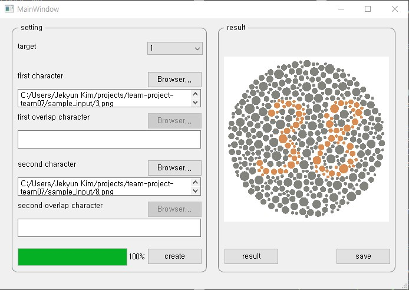

Colorbindness Test Generator
============================

team-project-team07 created by GitHub Classroom
-----------------------------------------------

## Introductions
### Necessity
## Introductions (Korean)
### About the project
1. 사용자로부터 이미지를 입력받아 한식색각검사표의 종류에 따라 원 도트 형태의 색각검사표로 변환해주는 프로그램
2. 기존 프로젝트의 한정된 변환방법과 달리 우리나라에서 사용하는 한식색각검사표의 모든 지표로 변환가능 (예. <제 4표> : 정상자-정상인식, 색각이상자-다른 숫자로 인식, 색맹자-인식불가능)
3. 제 1표 ~ 제 21표까지 총 21가지 방법으로 변환 가능
4. 전색맹, 적록색맹(제1색약, 제2색약), 청황색맹(제3색약) 판별 가능
### Necessity
1. 기존의 색각검사 방식은 숫자, 모양 등 형식이 정해져 있어 복수의 검사로 인해 익숙해진 피검자의 경우 검사 신뢰도가 하락할 수 있다.
2. 만약 사용자가 직접 텍스트/이미지를 입력하여 새로운 검사표를 만들 수 있다면 Test Pool이 한정되지 않아 피검자의 검사 결과에 대한 신뢰도를 향상시킬 수 있을 것이다.
3. 항공, 소방 등 색약/색맹의 여부 확인이 중요한 분야에 대한 기여를 기대할 수 있다.
### Example Flow
| 과정 | 이미지 |
|---|---|
| 1. 이미지 입력 |  |
| 2. 지표의 타입 지정 | ex. 제 1표 |
| 3. Generating |  |

이해를 돕기 위한 참고용 표로 지표의 종류에 따라 달라질 수 있음.

## Code Manual
We can generate a image about given target number & input numbers(or characters)
### Before Start (Packages)
1. You have to install it.
```
  pip install scipy
```
2. if you have this error >> ModuleNotFoundError: No module named 'PIL'
```  
  pip install pillow
```
3. For GUI, you have to install PyQt5. (Only in python3.x)
```
  pip install PyQt5
```
4. Before start, you have to include images you want in the directory.

### How to use
 

> Generate a Image.
>```
>  python colorblindness.py
>```
>```
>  target : 
>```
>You can choose 1 to 21 for indicators about colorblindness testing.
>```
>  first character : 
>```
>You can put 0 ~ 9 or A ~ Z for the main character(number).
>```
>  first overlap character : 
>```
>You can put 0 ~ 9 or A ~ Z for the confusing character(number).
>```
>  (Optional) second character : 
>```
>This option appears when program needs double figures. You can use as same as first image.
>```
>  (Optional) second overlap character : 
>```
>This option appears when program needs double figures. You can use as same as overlap image.
>```
>  target(지표) 별 유의사항
>```
>한 자리 숫자(문자) 사용 : 2, 4, 6, 8, 9표
>두 자리 숫자(문자) 사용 : 1, 3, 5, 7, 13~18표
>곡선 경로 사용 : 11, 12, 19, 20, 21표

## Under development
1. GUI Programming - It's released now.
2. Make a generate algorithm adjustment.
3. Ajusting color values.

## License
GNU General Public License v3.0
