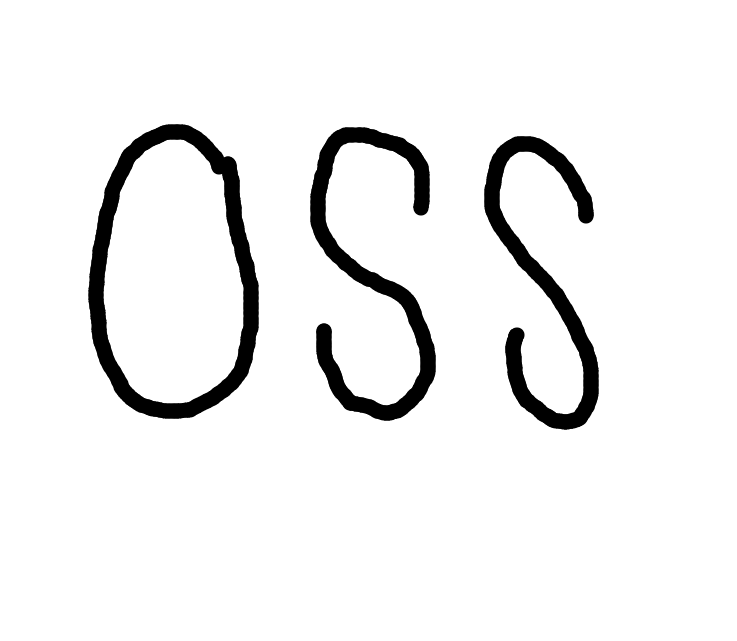
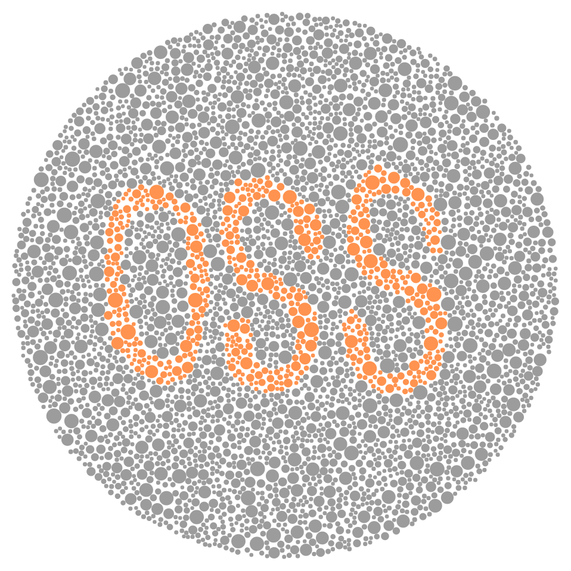

Colorbindness Test Generator
============================

team-project-team07 created by GitHub Classroom
-----------------------------------------------

## Introductions
### Necessity
## Introductions (Korean)
### About the project
1. 사용자로부터 이미지를 입력받아 한식색각검사표의 종류에 따라 원 도트 형태의 색각검사표로 변환해주는 프로그램
2. 기존 프로젝트의 한정된 변환방법과 달리 우리나라에서 사용하는 한식색각검사표의 모든 지표로 변환가능 (예. <제 4표> : 정상자-정상인식, 색각이상자-다른 숫자로 인식, 색맹자-인식불가능)
3. 제 1표 ~ 제 21표까지 총 21가지 방법으로 변환 가능
4. 전색맹, 적록색맹(제1색약, 제2색약), 청황색맹(제3색약) 판별 가능
### Necessity
1. 기존의 색각검사 방식은 숫자, 모양 등 형식이 정해져 있어 복수의 검사로 인해 익숙해진 피검자의 경우 검사 신뢰도가 하락할 수 있다.
2. 만약 사용자가 직접 텍스트/이미지를 입력하여 새로운 검사표를 만들 수 있다면 Test Pool이 한정되지 않아 피검자의 검사 결과에 대한 신뢰도를 향상시킬 수 있을 것이다.
3. 항공, 소방 등 색약/색맹의 여부 확인이 중요한 분야에 대한 기여를 기대할 수 있다.
### Example Flow
| 과정 | 이미지 |
|---|---|
| 1. 이미지 입력 |  |
| 2. 이미지 윤곽선 추출 |  |
| 3. 지표의 타입 지정 | ex. 제 1표 |
| 4. Generating |  |

이해를 돕기 위한 참고용 표로 지표의 종류에 따라 달라질 수 있음.

## Code Manual
### Before Start (Packages)
1. You have to install it.
```
  pip install scipy
```
2. if you have this error >> ModuleNotFoundError: No module named 'PIL'
```  
  pip install pillow
```
3. Before start, you have to include images you want in the directory.

### How to use
> Generate a Image.
>```
>  python colorblindness.py imagename target_num image image(Optional)
>```
>1. 'imagename' is name of a created image.
>2. You can put 1 to 11 on 'target_num' for indicators.
>3. You have to put a directory of inputed image on 'image'
>4. (Optional) If you want to merge two images for colorblindness testing, you have to put a directory of the second image.

## License
GNU General Public License v3.0
